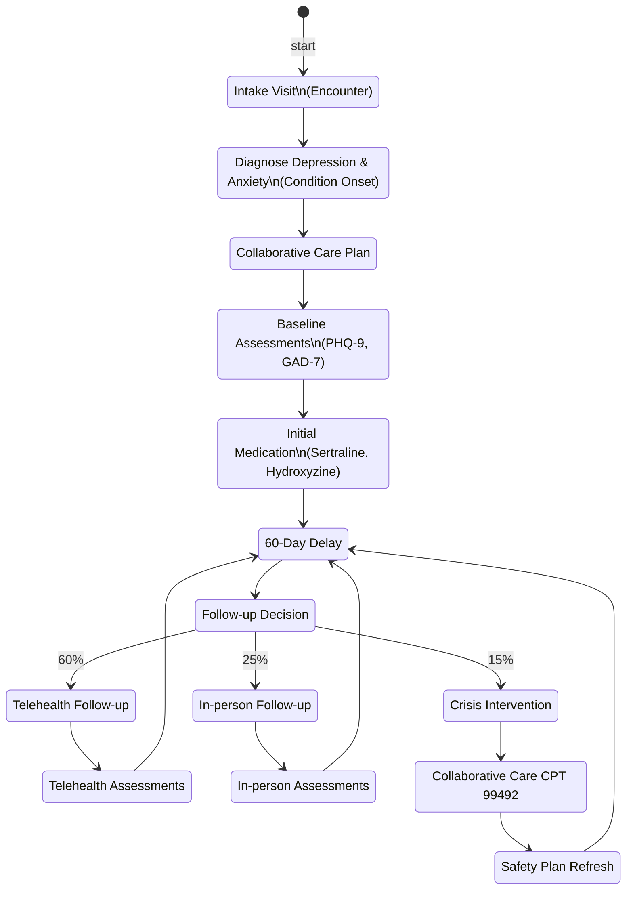

# Mental Health Integrated Care Module

**Legend**
- Decision branches reflect module probabilities (`follow_up_decision`).
- Observations capture PHQ-9/GAD-7 trajectories; crisis path adds CPT 99492 and returns to the follow-up loop via the safety plan.
