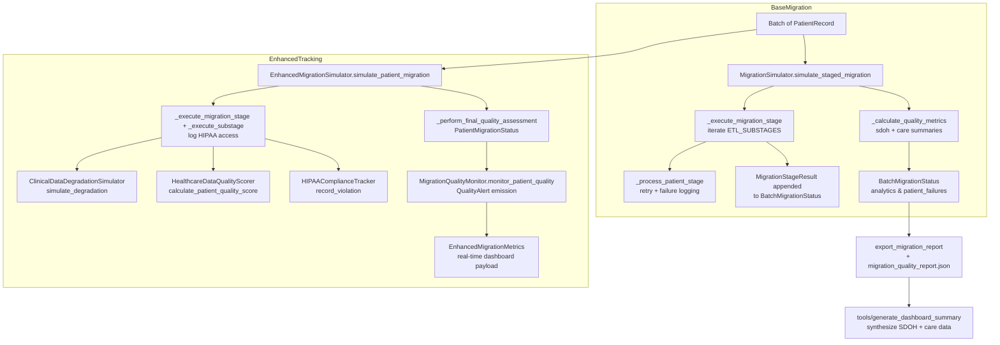

# Migration Quality Monitoring

Depicts how the baseline `MigrationSimulator` flow in `src/core/synthetic_patient_generator.py` connects with the enhanced tracking components in `src/core/enhanced_migration_simulator.py` and `src/core/enhanced_migration_tracker.py`.

