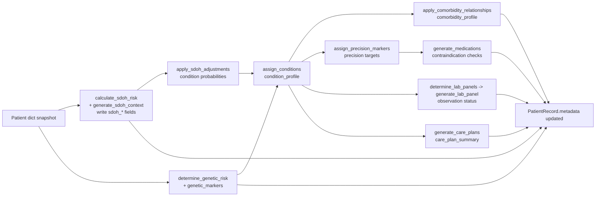

# Patient Attribute Enrichment

Captures how SDOH context, genetic markers, and precision medicine logic in `src/core/synthetic_patient_generator.py` evolve a base patient dictionary into rich metadata.

