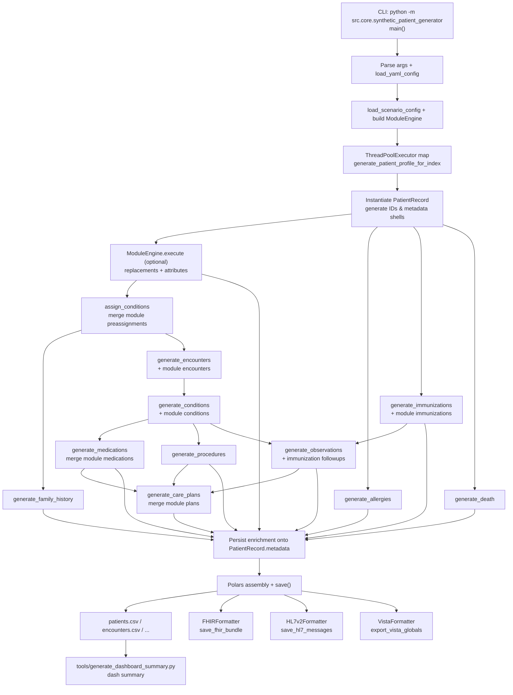

# Synthetic Data Pipeline

Visual overview of the orchestration in `src/core/synthetic_patient_generator.py`, focusing on how the CLI entrypoint fans out to generate patient records and export artifacts.

