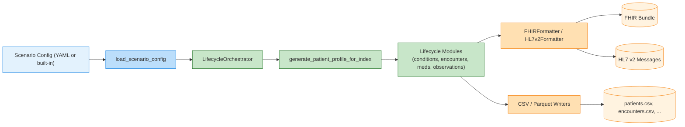

# Synthetic Patient Generator Flow

```mermaid
flowchart LR
    A["Scenario Config (YAML or built-in)"] --> B[load_scenario_config]
    B --> C[LifecycleOrchestrator]
    C --> D[generate_patient_profile_for_index]
    D --> E["Lifecycle Modules\n(conditions, encounters, meds, observations)"]
    E --> F[FHIRFormatter / HL7v2Formatter]
    E --> G[CSV / Parquet Writers]
    F --> H[(FHIR Bundle)]
    F --> I[(HL7 v2 Messages)]
    G --> J[(patients.csv, encounters.csv, ...)]
    style A fill:#e3f2fd,stroke:#1e88e5
    style B fill:#bbdefb,stroke:#1e88e5
    style C fill:#c8e6c9,stroke:#2e7d32
    style D fill:#c8e6c9,stroke:#2e7d32
    style E fill:#c8e6c9,stroke:#2e7d32
    style F fill:#ffe0b2,stroke:#f57c00
    style G fill:#ffe0b2,stroke:#f57c00
    style H fill:#fff3e0,stroke:#f57c00
    style I fill:#fff3e0,stroke:#f57c00
    style J fill:#fff3e0,stroke:#f57c00
```
