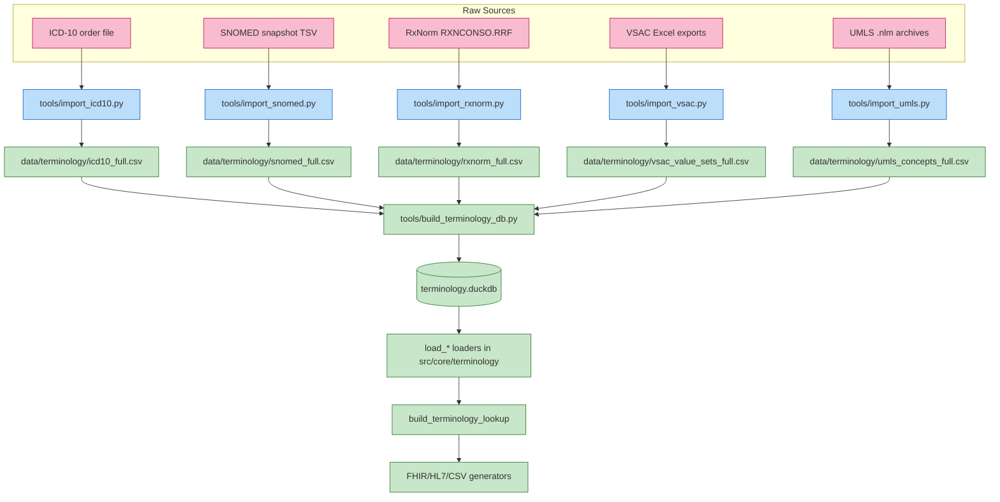

# Terminology Normalization & Lookup Pipeline

```mermaid
flowchart TD
    subgraph Raw Sources
        A[ICD-10 order file]
        B[SNOMED snapshot TSV]
        C[RxNorm RXNCONSO.RRF]
        D[VSAC Excel exports]
        E[UMLS .nlm archives]
    end

    A --> F[tools/import_icd10.py]
    B --> G[tools/import_snomed.py]
    C --> H[tools/import_rxnorm.py]
    D --> I[tools/import_vsac.py]
    E --> J[tools/import_umls.py]

    F --> K[data/terminology/icd10_full.csv]
    G --> L[data/terminology/snomed_full.csv]
    H --> M[data/terminology/rxnorm_full.csv]
    I --> N[data/terminology/vsac_value_sets_full.csv]
    J --> O[data/terminology/umls_concepts_full.csv]

    K & L & M & N & O --> P[tools/build_terminology_db.py]
    P --> Q[(terminology.duckdb)]

    Q --> R[load_* loaders in src/core/terminology]
    R --> S[build_terminology_lookup]
    S --> T[FHIR/HL7/CSV generators]

    classDef raw fill:#f8bbd0,stroke:#c2185b;
    classDef normalize fill:#bbdefb,stroke:#1565c0;
    classDef output fill:#c8e6c9,stroke:#2e7d32;

    class A,B,C,D,E raw;
    class F,G,H,I,J normalize;
    class K,L,M,N,O,P,Q,R,S,T output;
```

